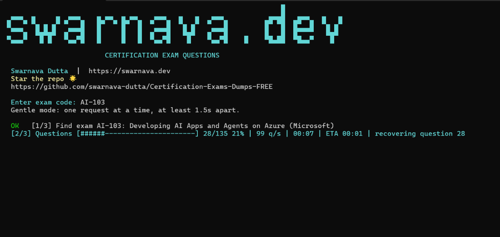

# Certification Exam Questions — Free Exam Dumps (Examtopics.com FREE Alternative)

Fetch available practice questions for a certification exam and turn them into a clean A4 PDF with answers, explanations, topics, and images.

[](https://github.com/swarnava-dutta/Certification-Exams-Dumps-FREE/stargazers)
[](https://github.com/swarnava-dutta/Certification-Exams-Dumps-FREE/forks)
[](https://github.com/swarnava-dutta/Certification-Exams-Dumps-FREE/issues)
[](https://github.com/swarnava-dutta/Certification-Exams-Dumps-FREE/commits/main)
[](LICENSE)
[](https://nodejs.org/)

<a href="https://buymeacoffee.com/swarnava"></a>



If this project saves you time, [give it a star](https://github.com/swarnava-dutta/Certification-Exams-Dumps-FREE). It helps other learners find it.

## Features

- Finds an exam from its code, such as `AZ-900`, `AI-103`, `AIF-C01`, or `PL-300`
- Creates a print-ready PDF with questions, answer choices, correct answers, explanations, topics, and available images
- Keeps each question and its answer together where possible
- Resumes interrupted downloads instead of starting over
- Reuses completed downloads for faster repeat runs
- Shows live progress, speed, elapsed time, and ETA
- Uses a gentle request rate of one request at a time
- Requires no npm packages

## Quick start on Windows

(Recommended)
Open Command Prompt and run:

```powershell
git clone https://github.com/swarnava-dutta/Certification-Exams-Dumps-FREE.git
cd Certification-Exams-Dumps-FREE
.\start.bat
```

No Git? [Download the ZIP](https://github.com/swarnava-dutta/Certification-Exams-Dumps-FREE/archive/refs/heads/main.zip), extract it, and double-click `start.bat`.

Enter an exam code when prompted. Your PDF will be saved to:

```text
output/<EXAM-CODE>/<EXAM-CODE>.pdf
```

On the first run, `start.bat` checks for Node.js 20+ and Microsoft Edge or Google Chrome. If Node.js or a supported browser is missing, it uses `winget` to install what is needed.

## Run a specific exam

Pass the exam code directly:

```powershell
.\start.bat AZ-900
```

If the same code exists under more than one provider, specify the provider:

```powershell
.\start.bat AIF-C01 --provider amazon
```

Download the exam again instead of reusing saved data:

```powershell
.\start.bat AZ-900 --refresh
```

Show the available options:

```powershell
.\start.bat --help
```

| Option | Purpose |
| --- | --- |
| `EXAM-CODE` | Exam code to find and download |
| `--provider SLUG` or `-p SLUG` | Select a provider when a code is ambiguous |
| `--refresh` | Ignore completed cached data and download again |
| `--help` or `-h` | Show command help |

## Manual setup

Install these first if `winget` is unavailable:

- [Node.js 20 or newer](https://nodejs.org/)
- Microsoft Edge or Google Chrome

Then run:

```powershell
node app.mjs AZ-900
```

No `npm install` step is required. If the browser is installed in a custom location, set its path for the current PowerShell session:

```powershell
$env:EXAM_BROWSER_PATH = "C:\Path\To\msedge.exe"
node app.mjs AZ-900
```

## How it works

1. Matches the exam code against the configured public catalog.
2. Downloads the available question pages and images at a controlled rate.
3. Saves progress under `.cache/` so an interrupted run can continue.
4. Checks that every question has text and an answer before creating the PDF.
5. Uses Edge or Chrome in headless mode to render the final A4 document.

Only the finished PDF is placed under `output/`. Working files stay under `.cache/`, and both directories are ignored by Git.

## Run the checks

Run the offline checks:

```powershell
npm test
```

Run the PDF rendering check as well:

```powershell
npm run test:pdf
```

The PDF check requires Microsoft Edge or Google Chrome.

## FAQ

### Does it support every certification exam?

It works when the exam code is available in the public catalog. Exam availability can change.

### Does the PDF include answers and explanations?

Yes, when they are available in the source. The app refuses to create an incomplete PDF when a question is missing its text or answer.

### Can an interrupted download continue?

Yes. Run the same exam code again and it resumes from the saved checkpoint.

### Where is the PDF saved?

The finished file is saved as `output/<EXAM-CODE>/<EXAM-CODE>.pdf`.

### How do I report a problem or request an exam?

[Open a GitHub issue](https://github.com/swarnava-dutta/Certification-Exams-Dumps-FREE/issues) with the exam code, provider, command used, and the error message. Do not include private account or session data.

## Support the project

If this tool helped with your exam preparation, you can [buy me a coffee](https://buymeacoffee.com/swarnava).

## Contributing

Bug fixes and focused improvements are welcome. Fork the repository, create a branch, run `npm test`, and open a pull request describing what changed.

## Disclaimer

This project is for personal study. It is not affiliated with or endorsed by any certification provider. Question availability and accuracy can change, so confirm current objectives and policies with the official provider.

## License

Released under the [MIT License](LICENSE).

Built by [Swarnava Dutta](https://swarnava.dev). If it helped, [star the repository](https://github.com/swarnava-dutta/Certification-Exams-Dumps-FREE) and share it with someone preparing for an exam.
